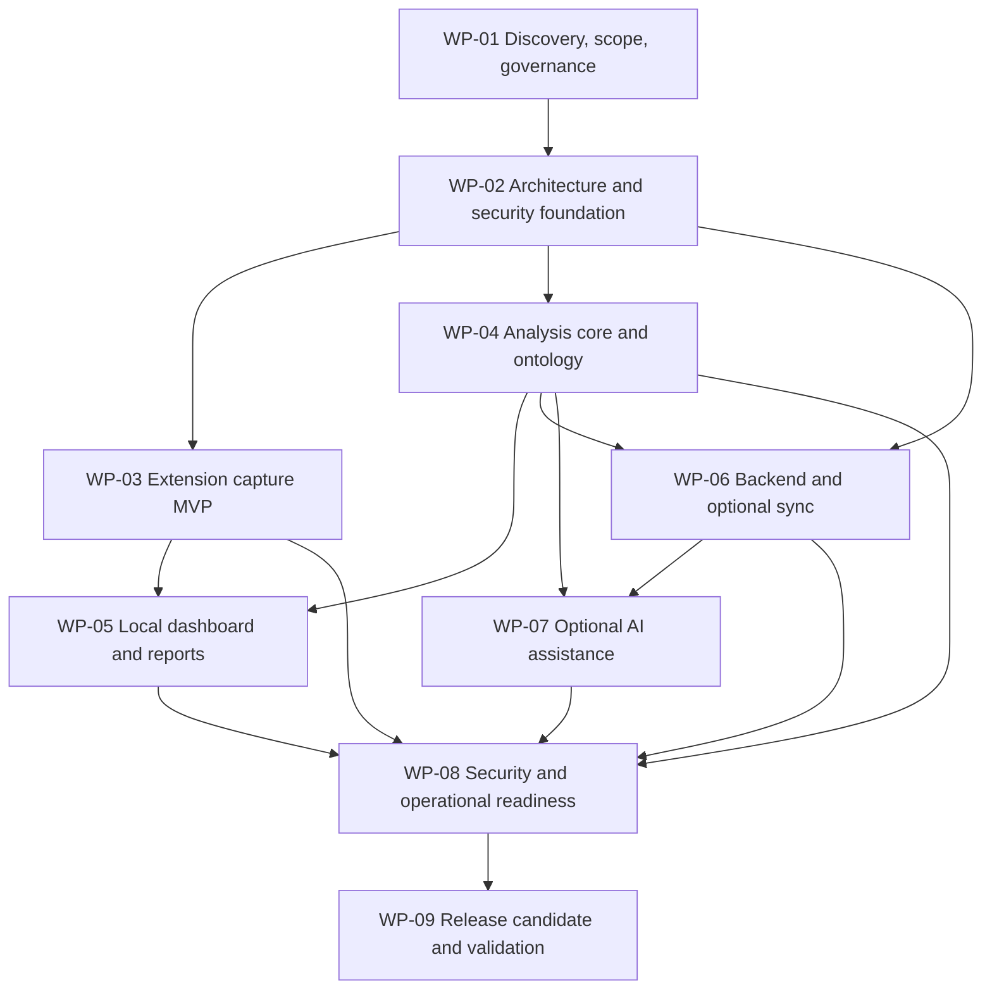

# JobSkillRadar Master Plan

Status: Draft — initial repository baseline  
Repository: `jobskill-radar`  
Date: 2026-09-17

## Current baseline

The repository was inspected before this plan was created. It contains no files or directories, so there are no existing implementation, documentation, configuration, or test conflicts. This plan does not claim that any feature, security control, or test is already implemented.

## Product scope

JobSkillRadar is a privacy-conscious tool for collecting a user's own captures of job advertisements and comparing normalized qualifications across jobs. Its central promise is evidence-backed analysis: every reported item must be traceable to a captured job and an evidence snippet, while deterministic analysis remains useful without an AI provider.

The initial architecture is a monorepo with a browser extension, a local web dashboard, independently testable shared analysis packages, and a modular-monolith API reserved for a later synchronization release. The system must treat captured pages and text as untrusted input and must not bypass authentication, paywalls, CAPTCHAs, robots restrictions, or other access controls.

## Scope refinement

### MVP: local-first usable release

The MVP should include:

- Manifest V3 Chrome/Edge extension with minimum permissions.
- Automatic current-page metadata/text extraction where available, selected-text capture, and manual paste fallback.
- Preview/edit before save, safe text rendering, duplicate warning, and local IndexedDB storage.
- Collections and captured-job management in a local dashboard.
- Versioned bilingual Thai/English ontology with aliases and preserved distinctions between related technologies.
- Deterministic extraction and classification for skills, experience, education, language, soft skills, work arrangement, and required/preferred signals.
- Unique-per-job frequency calculations, confidence, evidence snippets, source-job links, and manual corrections.
- Filters, comparison, CSV/JSON export, accessibility and responsive behavior.
- Golden bilingual corpus and measurable accuracy evaluation methodology.
- Security tests for hostile text, unsafe URLs, message validation, injection boundaries, and permission assumptions.

The MVP should not require cloud accounts, server-side URL fetching, external AI, file uploads, telemetry, automated crawling, or PDF export.

### Later releases

After the local MVP is reliable:

- WP-06: optional cloud synchronization with authentication, object authorization, PostgreSQL, deletion, and conflict handling.
- WP-07: opt-in provider-neutral AI assistance behind schema validation, evidence checks, cost controls, and deterministic fallback.
- WP-08: operational hardening, SBOM/scanning, incident response, backup/recovery, and release automation.
- WP-09: representative real-world validation, cross-browser verification, store preparation, performance testing, and final release review.
- PDF export, additional site adapters, and document upload only after their security and privacy designs are separately approved.

### Explicit exclusions

Mass crawling, access-control circumvention, automatic applications, credential/private-message collection, unsupported perfect-accuracy claims, antivirus functionality, salary prediction, recruitment workflows, native mobile apps, and premature microservices are out of scope.

## Decisions still requiring confirmation during planning

These are genuine design decisions, not blockers for WP-01. WP-01 should document options and recommend one with evidence:

1. Exact frontend build framework and workspace tooling for the extension/dashboard monorepo.
2. Exact supported Java 21 and Spring Boot 3.x versions, selected from currently supported releases.
3. Whether the first local dashboard is a browser page bundled with the extension or a separately served local web app.
4. Canonical local data model and migration/versioning strategy for IndexedDB.
5. Initial ontology coverage and the annotation protocol for the bilingual golden corpus.
6. Accuracy targets and evaluation thresholds, based on a defined, version-controlled dataset rather than arbitrary percentages.
7. Whether synchronization is API-backed only or also supports an export/import interchange format before WP-06.
8. Authentication mechanism for cloud sync, to be selected after the threat model and deployment assumptions are documented.

Assumptions until decided: local-only use is anonymous; no backend is needed for the MVP; all captured content is user-initiated; source URLs are stored as references but are not fetched by the backend; and AI is disabled by default.

## Work-package dependency map

WP-03 and WP-04 can proceed in parallel after WP-02 establishes shared contracts. WP-05 requires both. WP-06 and WP-07 are deliberately later than the deterministic/local foundation.

## Governance and session protocol

Every work package has separate planning, implementation, and review sessions. Planning produces an approved handoff and stops before implementation. Implementation changes only the approved package, adds tests, records deviations, updates documentation and risks, and hands off to review. Review is initially independent, reports severity-classified findings with file/line references, and does not silently fix defects.

A package is complete only when acceptance criteria, tests, security verification, documentation, ADR/risk updates, and clean handoff are complete, with no unresolved Critical or High review findings.

## Initial quality principles

- Evidence is mandatory for every reported result.
- A normalized skill counts at most once per job.
- Original captured text is immutable evidence; corrections are separate records.
- Low-confidence and AI-derived items remain distinguishable.
- Untrusted text never becomes executable instructions or privileged messages.
- Privacy defaults to local storage, no telemetry, explicit consent for transmission, and user-controlled deletion.
- Security documentation must distinguish designed, tested, and not-yet-verified controls.

## Planned documentation set

WP-01 should establish the requirements, personas, glossary, roadmap, definitions of ready/done, initial risk register, ADR template/index, and this governance baseline. WP-02 should add architecture, data flows, trust boundaries, privacy/threat models, development standards, CI gates, and proposed ADRs. Subsequent packages should update these documents rather than create parallel sources of truth.

## Immediate next step

Run the WP-01 planning session using `docs/prompts/wp-01/planning.md`. It must inspect this repository as the source of truth, validate the product scope, produce exact WP-01 deliverables and acceptance criteria, identify risks and dependencies, and stop before implementation.
