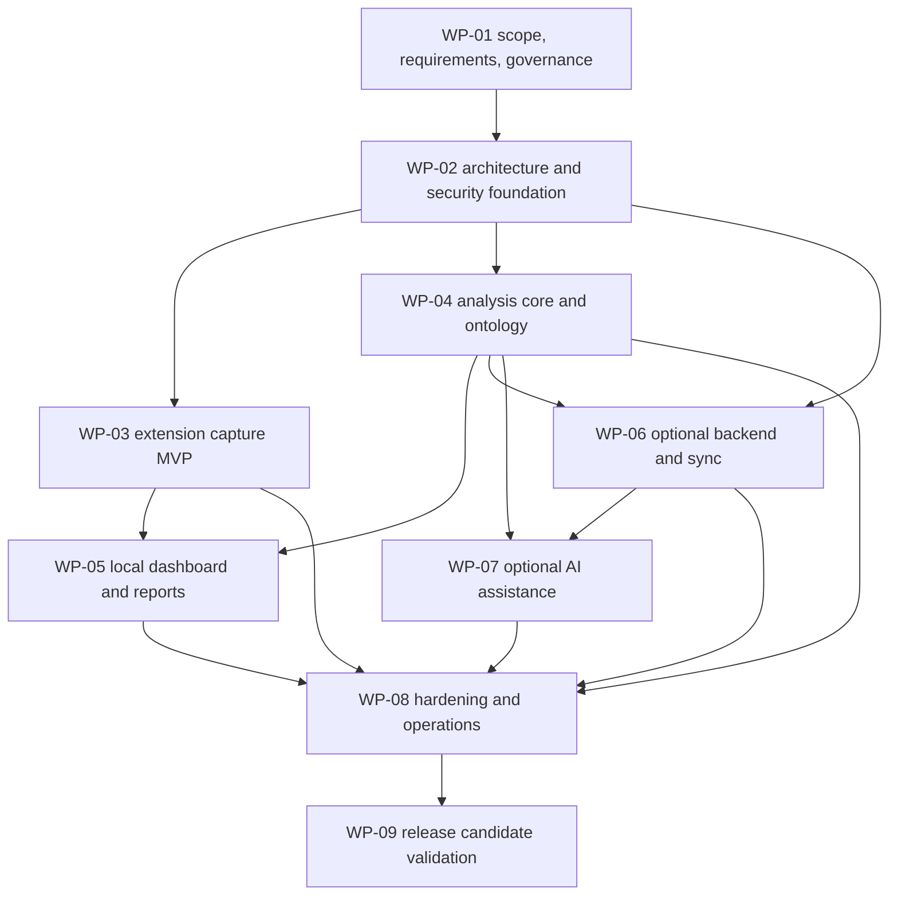

# WP-01 Planning Report and Implementation Handoff

Status: Proposed — awaiting approval  
Work package: WP-01 Discovery, scope, and engineering governance  
Planning date: 2026-09-17  
Planning boundary: documentation and governance only; no product implementation is authorized

## 1. Executive decision summary

The smallest useful release is a local-only browser extension plus a local dashboard that lets a user deliberately capture a job advertisement, review and edit the capture, store it on the device, classify qualifications deterministically in Thai and English, inspect evidence for each result, correct results without changing the original evidence, compare jobs, and export data. It does not need an account, server, AI provider, crawler, file upload, or backend URL fetch.

WP-01 should establish the product and engineering sources of truth. It should not select technologies without recorded evidence, claim that controls have been verified, or produce application code. All initial architectural decisions listed in this report remain `Proposed` until the WP-01 implementation session records the required evidence and an authorized reviewer accepts them.

## 2. Repository inspection and conflicts

### 2.1 Observed state

The planning session inspected the workspace at `C:\Projects\JobSkillRadar` on 2026-09-17.

Observed files:

- `docs/plans/master-plan.md`
- `docs/prompts/wp-01/planning.md`

No application source, package manifest, build configuration, CI configuration, tests, ontology, corpus, ADRs, risk register, or other project files were observed. The directory is not currently a Git worktree: `git status --short` returned “not a git repository.” Consequently, history, branches, tracked/untracked state, and unrelated user changes cannot be assessed through Git.

### 2.2 Conflicts and corrections to existing assumptions

- The master plan says the repository contains no files or directories. That statement is now stale because the two documentation files above exist. Its intended meaning—there is no implementation baseline—remains consistent with the observed state.
- Both existing Markdown files display mojibake in at least one punctuation character (for example, a dash rendered as `�?"` or `—`). The implementation session should normalize documentation encoding to UTF-8 after confirming the intended characters; this plan does not silently rewrite those files.
- The name `jobskill-radar` appears in the master plan, while the workspace is `JobSkillRadar`. A canonical product/repository slug is not yet evidenced and should be recorded as a documentation convention before tooling depends on it.
- The master plan labels Java 21/Spring Boot 3.x as a later backend direction. Since the local MVP requires no backend, these versions must not become MVP dependencies.
- No documentation convention exists beyond `docs/plans` and `docs/prompts`. The paths in section 17 are therefore proposed conventions, not established ones.

### 2.3 Unknowns

The following could not be verified from repository evidence:

- Product sponsor, accountable decision makers, named risk owners, target users, release date, budget, or staffing.
- Supported operating systems and exact browser versions.
- Distribution model: unpacked/internal install versus public browser stores.
- Data-retention expectations, applicable jurisdictions, or legal/privacy review needs.
- Representative Thai/English job-ad sources and permission to retain corpus samples.
- Performance budgets, accessibility conformance target, or minimum extraction accuracy.
- Whether a remote repository already exists elsewhere.

These unknowns must remain explicit and must not be converted into claims.

## 3. Scope baseline

### 3.1 Smallest useful local MVP

The MVP consists of these user-visible capabilities:

1. A Manifest V3 Chrome/Edge extension captures only after an explicit user action.
2. Capture supports current-page title, source URL, visible/relevant job text where available, selected text, and a manual paste fallback.
3. The user previews and can edit the proposed capture before saving.
4. Original captured evidence is retained immutably; later edits and analysis corrections are separate records.
5. Captures and collections are stored locally in a versioned IndexedDB schema and can be deleted by the user.
6. Duplicate detection warns rather than blocks and explains the matching basis.
7. A local dashboard supports job management, filtering, job-to-job comparison, and evidence inspection.
8. Deterministic bilingual analysis recognizes versioned canonical terms and aliases while preserving meaningful distinctions such as Java versus JavaScript and related-but-different frameworks.
9. Results cover skills, experience, education, language, soft skills, work arrangement, and required/preferred signals.
10. Each normalized item counts no more than once per job in frequency metrics, regardless of repeated mentions.
11. Every reported item links to a source job and a bounded evidence snippet; ambiguous or low-confidence results are visibly distinguished.
12. Users can accept, reject, add, or remap analysis results without altering captured evidence.
13. Users can export portable JSON and tabular CSV with documented schemas.
14. Core capture, review, evidence, correction, comparison, export, keyboard, responsive, and hostile-input behaviors are tested.

This scope is useful without cloud or AI because capture, analysis, comparison, correction, and export all operate locally.

### 3.2 Deferred to later work packages

- WP-06: optional authenticated cloud synchronization, PostgreSQL persistence, object-level authorization, deletion propagation, and conflict handling.
- WP-07: opt-in provider-neutral AI assistance with explicit transmission consent, structured output validation, evidence validation, budgets, and deterministic fallback.
- WP-08: operational hardening, software bill of materials, supply-chain scanning, incident response, backup/recovery for cloud data, and release automation.
- WP-09: representative real-world validation, cross-browser verification, store submission preparation, performance validation, and release review.
- Separately approved future scope: PDF export, more site-specific adapters, document/file upload, and import workflows beyond any agreed interchange format.

### 3.3 Non-goals

The following are explicitly outside the planned product boundary unless a later approved plan changes it:

- Mass or unattended crawling, scheduled scraping, and backend retrieval of source URLs.
- Bypassing authentication, paywalls, CAPTCHAs, robots controls, or other access restrictions.
- Automatic job applications, recruitment/ATS workflows, salary prediction, or applicant scoring.
- Credential, private-message, or unrelated browsing-data collection.
- Antivirus or malware-detection claims.
- Claims of perfect extraction, exhaustive ontology coverage, legal compliance, or unbiased outcomes.
- Native mobile applications and premature microservices.

## 4. Personas and principal journeys

### P-01: Individual job seeker

Needs to build a private, evidence-backed picture of recurring qualifications across jobs without creating an account or sending job text to a third party.

Primary journey: view a job page → invoke capture → inspect/edit preview → save locally → review extracted qualifications and evidence → correct errors → add to a collection → compare with other jobs → export or delete.

### P-02: Bilingual job seeker

Needs Thai and English terms in the same or different advertisements to map consistently while retaining the source wording and meaningful technology distinctions.

Primary journey: capture mixed-language ads → inspect canonical terms and aliases → see uncertain results → correct mappings → compare unique-per-job frequencies.

### P-03: Privacy-conscious user

Needs clear boundaries around collection, transmission, retention, deletion, and optional future services.

Primary journey: review what will be stored → use the complete MVP offline/local-only → export a backup → delete one job or all local data → verify no account, telemetry, or cloud transmission is required.

### P-04: Maintainer/analyst

Needs versioned requirements, ontology and corpus changes, reproducible evaluation, and traceable decisions so product claims can be reviewed.

Primary journey: propose a requirement/ontology change → link evidence and an ADR/risk → update labeled corpus if applicable → run deterministic evaluation → review regressions → approve or reject the change.

Personas are hypotheses until validated with representative users. WP-01 implementation should record the evidence source and validation status for each.

## 5. Requirement taxonomy

Requirement keywords use `MUST`, `SHOULD`, and `MAY` as priority signals, not claims of current implementation. Acceptance evidence must link to the relevant requirement IDs.

### 5.1 Functional requirements

| ID | Planned requirement | Release |
|---|---|---|
| FR-001 | The extension MUST initiate capture only from an explicit user action. | MVP |
| FR-002 | Capture MUST support page-derived content, selected text, and manual paste fallback. | MVP |
| FR-003 | The user MUST be able to preview and edit a capture before saving. | MVP |
| FR-004 | The system MUST store original captured evidence separately from user edits and correction records. | MVP |
| FR-005 | The system MUST support local collections and create, read, update, and delete operations for captured jobs. | MVP |
| FR-006 | The system MUST warn about probable duplicates and MUST allow the user to continue. | MVP |
| FR-007 | Deterministic analysis MUST classify the agreed qualification categories in Thai and English. | MVP |
| FR-008 | Every reported qualification MUST reference at least one source job and evidence span/snippet. | MVP |
| FR-009 | Frequency MUST count a canonical item at most once per job. | MVP |
| FR-010 | Users MUST be able to accept, reject, add, and remap results without changing original evidence. | MVP |
| FR-011 | The dashboard MUST filter jobs/results and compare selected jobs. | MVP |
| FR-012 | Users MUST be able to export documented JSON and CSV representations. | MVP |
| FR-013 | Users MUST be able to delete individual jobs, collections, and all local product data. | MVP |
| FR-014 | Optional sync MUST preserve authorization, deletion, version, and conflict semantics. | WP-06 |
| FR-015 | Optional AI assistance MUST require opt-in and MUST fall back to deterministic results. | WP-07 |

### 5.2 Non-functional and operational requirements

| ID | Planned requirement | Evidence needed before target approval |
|---|---|---|
| NFR-001 | Core MVP functions MUST work without network access after installation. | Automated offline scenario and network-observation test design. |
| NFR-002 | Deterministic analysis MUST produce reproducible results for the same input, ontology, and analyzer version. | Golden test with recorded versions and stable serialized output. |
| NFR-003 | Local schema and exports MUST be versioned and migratable. | Migration contract and fixtures spanning supported schema versions. |
| NFR-004 | Supported data volumes MUST remain usable within approved latency and storage budgets. | Representative volume study and device/browser baseline; numerical budgets remain TBD. |
| NFR-005 | Failures MUST preserve previously committed local records and provide actionable, non-sensitive messages. | Fault-injection and recovery scenarios. |
| NFR-006 | Browser/tooling dependencies MUST use supported releases and reproducible lockfiles. | Official support policies, compatibility spike, license/security review, and recorded ADR. |
| NFR-007 | Cloud components, when introduced, MUST define service objectives, observability, restore targets, and incident ownership before production use. | WP-06/WP-08 operational design and exercises. |

### 5.3 Security requirements

| ID | Planned requirement |
|---|---|
| SEC-001 | Captured page content MUST be treated as untrusted data and never interpreted as privileged instructions or executable markup. |
| SEC-002 | UI rendering MUST use safe text rendering; any unavoidable HTML parsing requires an approved sanitizer boundary and adversarial tests. |
| SEC-003 | Extension permissions and host access MUST be the minimum justified by documented capture flows. |
| SEC-004 | Extension messages MUST have explicit schemas, sender/context validation, size limits, and deny-by-default handling. |
| SEC-005 | Stored or opened URLs MUST be validated against an allowlist of required schemes; dangerous schemes MUST not become executable links. |
| SEC-006 | Imports/exports and future AI responses MUST be schema-validated with bounded sizes and safe failure behavior. |
| SEC-007 | Secrets MUST NOT be shipped in client bundles or committed to the repository. |
| SEC-008 | Future cloud APIs MUST authenticate requests and enforce object authorization independently for every operation. |
| SEC-009 | The product MUST NOT fetch source job URLs server-side or circumvent access controls. |
| SEC-010 | Dependencies and builds MUST be subject to agreed provenance, vulnerability, and update policies before release. |

### 5.4 Privacy requirements

| ID | Planned requirement |
|---|---|
| PRIV-001 | The MVP MUST default to local-only processing and storage with no account or telemetry. |
| PRIV-002 | The capture preview MUST make the content and source metadata to be stored inspectable before save. |
| PRIV-003 | Network transmission of captured content MUST require a separately described, explicit opt-in purpose. |
| PRIV-004 | Users MUST be able to export and delete their local data, including derived data and corrections. |
| PRIV-005 | Data inventory, purpose, location, retention behavior, and deletion semantics MUST be documented for each release. |
| PRIV-006 | Corpus examples MUST be licensed/permitted, minimized, and scrubbed of personal or unnecessary sensitive data before repository inclusion. |
| PRIV-007 | Privacy documentation MUST distinguish product behavior from unverified legal-compliance claims. |

### 5.5 Accessibility requirements

| ID | Planned requirement |
|---|---|
| A11Y-001 | All core workflows MUST be operable with a keyboard and expose logical focus order and visible focus. |
| A11Y-002 | Controls, statuses, errors, evidence, confidence, and corrections MUST have programmatic names/semantics and MUST not rely on color alone. |
| A11Y-003 | Text and interactive elements MUST meet the approved contrast and target-size criteria. |
| A11Y-004 | Dashboard layouts MUST remain usable at agreed viewport sizes and browser zoom levels. |
| A11Y-005 | Thai and English text, long tokens, and mixed-language content MUST render and reflow without loss of access to actions or evidence. |
| A11Y-006 | WP-02 MUST recommend a specific WCAG conformance target and browser/assistive-technology test matrix based on product distribution and stakeholder approval. |

### 5.6 Accuracy and evidence requirements

| ID | Planned requirement |
|---|---|
| ACC-001 | The ontology, analyzer rules, corpus, annotation guide, and evaluation output MUST be version-controlled together or by explicit compatible versions. |
| ACC-002 | Evaluation MUST report per-category and aggregate precision, recall, and F1, with language slices and support counts. |
| ACC-003 | Required/preferred classification and evidence-span correctness MUST be evaluated separately from entity recognition. |
| ACC-004 | Exact-match and documented canonical-equivalence rules MUST be fixed before scoring a corpus version. |
| ACC-005 | Train/development/test or authoring/evaluation separation MUST prevent tuning directly against the final evaluation set. |
| ACC-006 | Accuracy targets MUST be adopted only after baseline measurement on a representative, quality-reviewed bilingual corpus. |
| ACC-007 | Reports MUST disclose dataset version, sample composition, exclusions, confidence intervals or uncertainty where appropriate, and known limitations. |
| ACC-008 | No UI or documentation may imply perfect, exhaustive, or universally representative extraction. |

## 6. Glossary and domain rules

| Term | Working definition |
|---|---|
| Captured job | A user-created local record representing a job advertisement and its capture metadata. It is not proof that the source remains available or unchanged. |
| Original evidence | The exact text and metadata accepted at save time. Immutable after creation except through explicit record deletion. |
| Evidence span | Character-offset reference into original evidence; a display snippet is derived from and must remain traceable to it. Offset convention is an open decision. |
| Evidence snippet | A bounded, safely rendered excerpt shown to explain a result. It is not an independent source of truth. |
| Canonical item | Stable ontology identifier used for aggregation, distinct from its display label and source aliases. |
| Alias | Surface form that may map to a canonical item under documented context rules. |
| Distinction rule | Rule preventing unsafe conflation of related terms, such as Java and JavaScript. |
| Qualification occurrence | One detected mention linked to an evidence span. Multiple occurrences may map to one item. |
| Unique-per-job frequency | Number of distinct jobs containing an accepted canonical item; repeated mentions in one job contribute one. |
| Correction | Append-only or separately versioned user decision that accepts, rejects, adds, or remaps an analysis result without editing original evidence. |
| Required/preferred signal | Evidence-backed classification of whether an employer presents a qualification as mandatory or desirable; “unknown” is valid. |
| Confidence | Calibrated or rule-derived indication of uncertainty with documented meaning; not a probability unless validated as one. |
| Collection | User-defined grouping of captured jobs. |
| Local dashboard | User interface operating on the local store; packaging as an extension page versus separately served app is undecided. |
| Ontology version | Identifier for a coherent set of canonical items, aliases, relationships, and distinction rules. |
| Corpus | Versioned set of permitted, minimized text samples and gold annotations used for evaluation. |
| Deterministic analysis | Analysis whose output is reproducible for fixed input, configuration, ontology, and analyzer versions and does not require an external AI service. |
| Duplicate candidate | A non-blocking similarity warning based on a documented key or score; not a guaranteed duplicate. |

The implementation session should move this glossary into its own source-of-truth document and add rules for term ownership, deprecation, and identifier stability.

## 7. Accuracy evaluation method

### 7.1 Corpus design

The corpus plan must define sampling before targets. It should stratify permitted examples by language (`th`, `en`, mixed), job family, seniority, source format, length, and presence/absence of qualification categories. The register must record provenance or synthetic-generation method, usage permission, minimization review, annotator assignment, and split. Raw third-party advertisements must not be committed until retention and licensing are approved.

Recommended corpus structure is metadata plus text fixtures with opaque IDs. Personal names, contact details, tracking parameters, unrelated page text, and application credentials should be excluded or replaced. Synthetic examples may test edge cases but must be reported separately from representative real-world results.

### 7.2 Annotation protocol

The guide must specify:

- Annotation unit and Unicode/offset convention.
- Canonical item, source span, category, required/preferred/unknown label, and language fields.
- How to annotate aliases, negation, headings, lists, ranges of experience, implicit requirements, ambiguous terms, and overlapping spans.
- When to choose `unknown`, mark an adjudication case, or decline to map.
- Distinction rules and ontology-version compatibility.
- Independent double annotation for a defined sample, agreement calculation, and adjudication by a designated domain reviewer.

### 7.3 Metrics

For each class and slice, compute `TP`, `FP`, and `FN`, then:

- Precision = `TP / (TP + FP)`.
- Recall = `TP / (TP + FN)`.
- F1 = `2 × precision × recall / (precision + recall)` when defined.

Report micro and macro aggregation, raw support, and error categories. Score entity/canonical mapping, evidence-span correctness, and required/preferred classification separately. Define zero-denominator handling and whether span matching is exact or overlap-based before running evaluation. Job-level unique-frequency correctness needs its own fixtures for repeated mentions and aliases.

### 7.4 Target-setting rule

WP-01 must not invent a percentage target. The sequence is:

1. Approve corpus inclusion and annotation rules.
2. Measure annotator agreement and resolve systematic ambiguity.
3. Freeze a corpus version and hidden evaluation split.
4. Run a deterministic baseline and publish slice-level results and error analysis.
5. Assess user harm and tolerance for false positives versus false negatives per category.
6. Propose release gates with stakeholder justification, minimum slice support, and regression tolerance.
7. Approve targets through a decision record; revise only with a new recorded rationale and corpus version.

## 8. Work-package roadmap and dependencies



| Package | Needs from WP-01 | Must return/update |
|---|---|---|
| WP-02 | Approved scope, requirement IDs, constraints, risk and ADR conventions, personas/journeys. | Architecture, trust boundaries, local data model, packaging decision, standards, threat/privacy models, test strategy, CI gates, evidence-backed tooling ADRs. |
| WP-03 | Capture requirements, evidence immutability, permission constraints, hostile-input rules. | Capture implementation evidence, permission/message tests, adapter limitations, updated risks and requirements traceability. |
| WP-04 | Domain glossary, categories, distinction rules, corpus/evaluation protocol. | Versioned ontology/analyzer, corpus governance evidence, baseline results, accuracy risks and limitations. |
| WP-05 | Journeys, dashboard/report requirements, data contracts from WP-02/03/04. | Accessible workflows, comparisons, corrections, exports, end-to-end evidence and test results. |
| WP-06 | Deferred cloud boundary, privacy/security requirements, local schema/export contracts. | Auth and authorization design, sync/conflict/deletion semantics, operations and verification evidence. |
| WP-07 | AI opt-in boundary, evaluation rules, deterministic baseline, WP-06 controls if remote. | Provider abstraction, consent/cost/schema/evidence controls, comparative evaluation, fallback tests. |
| WP-08 | Accumulated risk register, security and operational requirements, implemented system. | Hardening evidence, supply-chain controls, runbooks, recovery exercise, release gates. |
| WP-09 | Completed prior packages, measurable acceptance criteria, approved target environments. | Real-world validation, browser/store evidence, final limitations, go/no-go record. |

WP-03 and WP-04 may run in parallel only after WP-02 freezes their shared contracts. WP-05 requires both. WP-06 is not a prerequisite for the local MVP. WP-07 must not become a prerequisite for deterministic analysis.

## 9. Definition of Ready

A work package is ready for implementation only when:

- Its scope, non-goals, dependencies, outputs, and named accountable owner are documented and approved.
- Applicable requirement IDs and acceptance criteria are testable and traceable.
- Required upstream ADRs/contracts are accepted or an explicit, time-bounded spike is approved.
- Security, privacy, accessibility, and data implications are identified with verification tasks.
- Test data is permitted, minimized, and available, or a safe synthetic substitute is defined.
- Tooling, environment, and supported target assumptions are recorded.
- High/Critical risks have an owner, action, trigger, contingency, and verification method; accepting a risk requires named authority and rationale.
- Open decisions that could invalidate implementation are resolved; remaining unknowns have owners and due points.
- Expected files and review boundaries are defined, and unrelated user changes have been identified through available source control.

WP-01 implementation is ready only after this proposed plan is approved and accountable roles are assigned. Repository initialization may require separate authorization if it is not already managed elsewhere.

## 10. Definition of Done

A work package is done only when:

- Every in-scope acceptance criterion has objective evidence, and requirements are traced to implementation and tests where applicable.
- Planned automated tests pass in the approved environment; manual checks have dated records and named reviewers.
- Security, privacy, accessibility, accuracy, and operational checks applicable to the package are completed or explicitly marked not applicable with rationale.
- Documentation, ADRs, risk entries, limitations, schemas, and migration notes are current.
- No unresolved Critical or High review finding remains. Deferral of lower-severity findings has an owner and target package/date.
- Generated artifacts and dependency changes are reviewed, reproducible, and licensed as required.
- An independent review has been completed and deviations from plan are recorded.
- Handoff includes changed files, commands run, results, residual risks, open decisions, and rollback/recovery information where applicable.

For WP-01 specifically, “done” means the approved documentation set exists, cross-document links/IDs validate, all decisions remain accurately labeled, named role assignments replace placeholders where required, and no feature code or infrastructure has been introduced.

## 11. Risk method

### 11.1 Scoring

Likelihood and impact are scored independently from 1 to 5. Score = likelihood × impact.

| Rating | Likelihood definition | Impact definition |
|---|---|---|
| 1 | Rare; exceptional conditions required. | Negligible; little user or delivery effect. |
| 2 | Unlikely but plausible. | Minor; limited reversible degradation. |
| 3 | Possible in normal project conditions. | Moderate; material rework, user confusion, or bounded data/control failure. |
| 4 | Likely without active control. | Major; release failure, significant privacy/security/accessibility harm, or major rework. |
| 5 | Almost certain/currently occurring. | Severe; broad or irreversible harm, access-control failure, major data exposure/loss, or project invalidation. |

| Score | Severity | Governance response |
|---|---|---|
| 1–4 | Low | Track; review at package boundary. |
| 5–9 | Medium | Owner and planned action; verify before affected release. |
| 10–16 | High | Treatment and contingency required before affected implementation/release; review every package. |
| 17–25 | Critical | Stop affected work/release until reduced or explicitly accepted by authorized sponsor/security/privacy owner. |

Inherent and residual scores must be separate. Documentation alone does not reduce a score. Residual likelihood/impact may change only after the stated verification evidence is reviewed.

### 11.2 Risk-register fields

Each entry should contain: ID, title, cause, event, consequence, affected requirements/assets, category, owner role/name, raised/review dates, inherent likelihood/impact/score, current controls with status (`planned`, `implemented`, `tested`, `verified`), treatment, action owner/due point, trigger/early indicator, contingency, verification method/evidence link, residual score, status, accepting authority, and related ADR/package.

### 11.3 Seed risks

Owners below are roles to be replaced by named accountable people during WP-01 implementation.

| ID | Risk and consequence | L×I | Sev. | Owner | Trigger | Planned treatment and verification | Contingency |
|---|---|---:|---|---|---|---|---|
| R-001 | Untrusted captured content crosses an execution/HTML/message boundary, causing script execution or privilege misuse. | 4×5=20 | Critical | Security owner | Any raw HTML rendering, dynamic code path, permissive message handler, or dangerous URL accepted. | Threat-model boundaries; safe text API standard; URL/message schemas; adversarial fixtures; extension security review. Status: planned only. | Block release/disable affected capture or rendering path; remove stored active content; investigate exposure. |
| R-002 | Extension permissions or host access are broader than journeys justify, exposing browsing data and undermining trust/store approval. | 4×4=16 | High | Extension lead | New permission/host wildcard or background access requested. | Permission budget mapped to journeys; install-time review; automated manifest assertion; manual browser review. | Reject permission increase; use active-tab/manual-paste flow; defer adapter. |
| R-003 | Stored job text contains personal/sensitive data and is transmitted or retained unexpectedly. | 3×5=15 | High | Privacy owner | Telemetry/network dependency, sync/AI proposal, unclear deletion, corpus capture. | Local-only default; data inventory/flow review; network tests; explicit consent design; deletion tests. | Disable transmission; notify governance owner; provide deletion/export guidance; assess incident obligations. |
| R-004 | Ontology conflates distinct technologies or misses Thai/English variants, producing misleading frequency insights. | 4×4=16 | High | Analysis lead | High confusion-pair errors, user corrections, or poor language-slice recall. | Versioned IDs/aliases/distinction tests; bilingual corpus; sliced metrics; error review. | Label uncertainty; permit remap; roll back ontology version; narrow supported claims. |
| R-005 | Corpus is unrepresentative, contaminated, impermissibly retained, or tuned against, invalidating accuracy claims. | 4×4=16 | High | Evaluation lead | Unknown provenance, skewed slices, duplicate leakage, target set before baseline. | Corpus register; permission/minimization review; fixed splits; double annotation; provenance and leakage checks. | Withdraw claims/artifacts; rebuild corpus; repeat independent evaluation. |
| R-006 | IndexedDB schema changes corrupt or orphan evidence/corrections. | 3×5=15 | High | Data architecture owner | Migration introduced without fixtures/rollback; interrupted upgrade loses links. | Versioned schema ADR; invariant and migration tests with backup/export path; fault injection. | Stop upgrade; preserve old store; restore/import compatible export; ship corrective migration. |
| R-007 | Cloud object-authorization flaw exposes one user’s captures to another. | 3×5=15 | High | Backend security owner | WP-06 endpoint accepts user-controlled object ID without policy test. | Per-object authorization design; negative multi-user integration tests; security review. | Block sync release; disable endpoint; revoke tokens; incident-response process. |
| R-008 | Optional AI leaks content, fabricates unsupported results, or becomes required for core use. | 4×4=16 | High | AI feature owner | Content transmitted without granular consent; result lacks valid evidence; deterministic tests fail when provider unavailable. | Default-off consent; provider/data disclosure; schema/evidence validation; quotas; no-network fallback tests. | Disable provider feature; discard unverified outputs; retain/recompute deterministic results. |
| R-009 | Lack of source control loses decisions or prevents reliable review/audit. | 4×4=16 | High | Project lead | WP-01 implementation begins with no managed repository/history. | Confirm external VCS or initialize approved repository; branch/review convention; backup policy; verify clean status and recoverability. | Pause implementation; archive docs safely; establish reviewed baseline before code. |
| R-010 | Accessibility barriers make core workflows unusable by keyboard or assistive-technology users. | 3×4=12 | High | UX/accessibility owner | Keyboard trap, inaccessible evidence state, contrast/reflow failure. | Accessibility target ADR; semantic component rules; automated checks plus keyboard/screen-reader manual matrix. | Block affected workflow release; offer accessible alternative; remediate before release. |
| R-011 | Source sites change or block extraction, making automatic capture unreliable. | 4×3=12 | High | Extension lead | Adapter extraction success/regression falls below approved threshold. | Generic extraction contract; fixture tests; preview/edit and selection/paste fallback; adapter telemetry remains out of MVP. | Disable broken adapter; preserve manual capture path; document limitation. |
| R-012 | Export exposes more data than expected or spreadsheet-formula payloads execute when CSV is opened. | 3×4=12 | High | Dashboard lead | Exported fields exceed preview/schema or cells begin with executable formula markers. | Export data classification; explicit schema/preview; CSV injection neutralization tests; round-trip tests. | Disable affected export format; advise deletion/re-export; patch encoder. |
| R-013 | Unsupported dependency/browser/backend choices create early security or compatibility debt. | 3×4=12 | High | Architecture owner | Tool selected without official support horizon, compatibility proof, or update policy. | Time-boxed spike; official-source evidence; dependency/license review; ADR and support matrix. | Replace before implementation expands; isolate through stable contracts. |
| R-014 | Scope drift makes cloud, AI, or backend a hidden MVP dependency. | 4×3=12 | High | Product owner | MVP acceptance references accounts, server, AI, or network. | Requirement traceability and package gates; local offline acceptance test. | Remove dependency or move feature to later package; reapprove scope if value case changes. |

## 12. ADR approach and proposed index

### 12.1 Lifecycle

Use immutable numbered ADRs under `docs/adr/`. Status values: `Proposed`, `Accepted`, `Rejected`, `Superseded`, and `Deprecated`. A decision is `Proposed` while evidence or approval is incomplete. Changing an accepted decision requires a new ADR that supersedes it; do not rewrite its outcome silently.

Each ADR should include: title/status/date; owners/deciders; context and forces; decision scope; options; evidence and experiments; decision; consequences/tradeoffs; security/privacy/accessibility/operations effects; validation plan; rollback/revisit triggers; related requirements, risks, and ADRs.

### 12.2 Initial index

| ADR | Proposed subject | Evidence required before acceptance | Target package |
|---|---|---|---|
| ADR-0001 | Frontend workspace, language, build, test, and package tooling. | Official support/release policies; MV3 and target-browser compatibility; reproducible build spike; extension/dashboard sharing; test ecosystem; dependency/license/security/update burden; contributor environment constraints. | WP-01 proposal; accept by WP-02 |
| ADR-0002 | Local dashboard packaging: extension page versus separately served app. | Offline journey comparison; permissions/CSP implications; IndexedDB sharing constraints; install/update UX; accessibility/testing; browser support; migration path. | WP-02 |
| ADR-0003 | Canonical local data model, IDs, evidence offsets, IndexedDB wrapper, and migrations. | Domain invariants; transaction/failure behavior; browser quotas; migration/backup fixtures; export compatibility; performance prototype; supported-browser behavior. | WP-02 |
| ADR-0004 | Bilingual ontology model, initial coverage, aliases, distinctions, and governance. | Representative sample inventory; domain-review capacity; ambiguity/error analysis; versioning needs; user journeys; licensing/provenance constraints. | WP-04 planning, foundations in WP-01 |
| ADR-0005 | Corpus annotation protocol and accuracy release gates. | Approved permitted corpus; annotation trial/agreement; baseline metrics by slice; user-harm analysis; confidence/uncertainty method; dataset size/support. | WP-04; do not set target in WP-01 |
| ADR-0006 | Export/import interchange before cloud sync. | User backup/migration needs; privacy and schema-version risks; round-trip/security prototype; support cost; relationship to WP-06 conflicts. | WP-02/WP-05 |
| ADR-0007 | Supported Java 21 and Spring Boot 3.x line for optional backend. | At WP-06 planning time: official vendor/Spring support matrices and maintenance dates; compatibility/BOM; security advisories; PostgreSQL/deployment compatibility; team/runtime constraints; reproducible prototype. No backend dependency for MVP. | WP-06 |
| ADR-0008 | Cloud authentication and session model. | Deployment topology; client types; threat model; identity/privacy requirements; account recovery/deletion; standards and provider support; authorization prototype; operational ownership. | WP-06 |
| ADR-0009 | Accessibility conformance target and verification matrix. | Distribution markets; applicable stakeholder/legal guidance; target browsers; assistive technologies; manual-test capacity; design-system feasibility. | WP-02 |
| ADR-0010 | Product/repository naming and documentation conventions. | Sponsor naming decision, hosting/VCS constraints, package-name availability, migration cost. | WP-01 |

No option above is accepted by this planning report.

## 13. Security, privacy, accessibility, accuracy, and test strategy

### 13.1 WP-01 verification

WP-01 verifies documentation quality, not product behavior. It should:

- Map every MVP capability to requirement IDs and a future work package.
- Run link, Markdown, duplicate-ID, required-section, Mermaid parse, and terminology checks.
- Review data inventory and flows for missing collection/transmission/deletion paths.
- Conduct a structured threat workshop covering page/content, extension contexts, storage, export, future sync, and AI boundaries.
- Review permission and privacy claims against actual planned journeys.
- Review corpus provenance/minimization and annotation protocol with Thai/English domain input.
- Review personas and accessibility journeys with representative users or explicitly record that evidence as missing.
- Record checklist results as `passed`, `failed`, `not run`, or `not applicable`; never use “verified” for an unexecuted check.

### 13.2 Downstream test layers

- Unit: normalization, alias boundaries, distinctions, required/preferred rules, URL/schema validation, unique-per-job aggregation, export escaping.
- Property/fuzz: Unicode and mixed-language text, malformed messages/imports, large inputs, offsets, deterministic/idempotent behavior.
- Contract: extension messages, local schema/migrations, analyzer output, exports/imports, future API schemas.
- Integration: capture-to-store, store-to-analysis, correction overlay, deletion, migration, sync authorization/conflicts.
- End-to-end: offline capture/preview/save/analyze/correct/compare/export/delete journeys.
- Security: hostile markup, script-like text, unsafe URLs, sender confusion, message size, CSP assumptions, dependency scans, multi-user authorization in WP-06.
- Accessibility: automated rules plus keyboard, focus, zoom/reflow, high contrast, and selected screen-reader/browser checks.
- Accuracy: frozen bilingual corpus, slice metrics, evidence-span and classification metrics, regression/error reports.
- Operational: reproducible build, upgrade/rollback, backup/restore where cloud exists, dependency update, incident/recovery exercises.

## 14. Open decisions, assumptions, and constraints

### 14.1 Assumptions to validate

- A1: local anonymous usage provides enough value for the first release.
- A2: all capture is user-initiated from content the user is already entitled to view.
- A3: retaining source URL/title and accepted text locally is acceptable to target users.
- A4: deterministic rules plus a governed ontology can reach a useful baseline for Thai and English.
- A5: Chrome and Edge share enough MV3 behavior for the initial extension design.
- A6: manual selection/paste is an acceptable fallback when page extraction fails.
- A7: the dashboard can operate on the same local dataset without a backend.

### 14.2 Constraints

- Local MVP must not require network access, accounts, cloud sync, or AI.
- Original evidence must remain separable from derived data and corrections.
- Source URLs are references and must not be fetched by a backend.
- User/page text is untrusted at every boundary.
- No implementation exists to validate; all product controls remain planned.
- The current directory has no observable Git metadata.

### 14.3 Evidence backlog

Before the affected ADR is accepted, collect:

- Stakeholder interviews and prioritized journeys, including bilingual and accessibility perspectives.
- Target OS/browser versions and extension distribution constraints from official browser documentation/store policies.
- Frontend tooling support/security/license data and a minimal throwaway compatibility spike in WP-02—not product implementation in WP-01.
- IndexedDB quota, transaction, migration, and extension-context evidence on the target browser matrix.
- Permitted representative job-ad sample inventory and Thai/English annotation expertise.
- Baseline accuracy results and category-specific harm analysis.
- Cloud deployment, identity, privacy, tenancy, recovery, and operating-owner assumptions before WP-06.
- At WP-06 planning time, current official Java vendor and Spring support information rather than dates copied prematurely into WP-01.

## 15. WP-01 implementation deliverables

The implementation session should create a coherent documentation baseline only:

1. Product brief and scope with personas and journeys.
2. Categorized, uniquely identified requirements and traceability matrix.
3. Glossary/domain rules.
4. Work-package roadmap and dependency map.
5. Governance guide with session boundaries, status vocabulary, Definition of Ready, Definition of Done, review severity, and change control.
6. Risk method and initial register with named role owners, actions, triggers, contingencies, and verification states.
7. ADR template, README/index, and initial `Proposed` ADRs.
8. Security/privacy baseline including preliminary data inventory, data-flow/trust-boundary questions, and threat-model plan.
9. Accessibility and accuracy/evaluation plans, including corpus/annotation governance without unsupported targets.
10. WP-01 acceptance report and handoff to WP-02.

## 16. WP-01 acceptance criteria

| ID | Acceptance criterion |
|---|---|
| WP01-AC-01 | Repository inspection is dated and states that Git metadata and implementation were not observed, without claiming the workspace is empty. |
| WP01-AC-02 | MVP, deferred scope, and non-goals are explicit and consistent across product, roadmap, and requirements documents. |
| WP01-AC-03 | Every requirement has a unique stable ID, category, priority/release, verification approach, and responsible work package in traceability data. |
| WP01-AC-04 | Personas and end-to-end journeys cover standard, bilingual, privacy, correction, fallback, export, deletion, and accessibility needs; unvalidated personas are labeled hypotheses. |
| WP01-AC-05 | Glossary defines evidence, canonicalization, frequency, corrections, confidence, and versioning without conflating original and derived data. |
| WP01-AC-06 | Roadmap states dependency gates and keeps cloud/AI outside the local MVP critical path. |
| WP01-AC-07 | Ready/Done definitions require objective evidence and prohibit unresolved Critical/High review findings at completion. |
| WP01-AC-08 | Risk matrix is reproducible; each High/Critical seed risk has an accountable named role, trigger, planned treatment, contingency, verification method, and honest control status. |
| WP01-AC-09 | ADR template/index exists; unresolved choices are `Proposed`; every initial decision lists alternatives/evidence needed and related risks/requirements. |
| WP01-AC-10 | Accuracy plan defines permitted corpus governance, annotation, splits, precision/recall/F1, slices, support, uncertainty, and baseline-first target setting. |
| WP01-AC-11 | Security/privacy plan addresses untrusted content, extension permissions/messages, unsafe URLs, local data, exports, deletion, future sync/AI, and the prohibition on backend URL fetching. |
| WP01-AC-12 | Accessibility plan defines how an evidence-backed target and automated/manual matrix will be selected before release. |
| WP01-AC-13 | Documentation checks run cleanly or every failure is recorded with an owner; no check is described as run unless evidence exists. |
| WP01-AC-14 | WP-01 changes contain documentation/governance artifacts only—no application source, installed dependencies, build infrastructure, extension, dashboard, or API. |
| WP01-AC-15 | Independent review confirms cross-document consistency, link/ID validity, accurate status language, and preservation of unrelated changes. |

## 17. Exact planned file changes

Paths are proposed because no established convention exists beyond `docs/plans` and `docs/prompts`.

### Modify

- `docs/plans/master-plan.md` — correct stale repository-baseline wording, normalize confirmed encoding issues, link WP-01 sources of truth, and preserve its high-level role.

### Create

- `README.md` — short project status, scope, documentation map, and explicit “no implementation yet” statement.
- `docs/product/product-brief.md` — value proposition, personas, journeys, MVP/later/non-goals, assumptions, constraints.
- `docs/product/requirements.md` — requirement catalog and verification notes.
- `docs/product/traceability.md` — requirement-to-package/acceptance/evidence mapping.
- `docs/product/glossary.md` — canonical domain terms and rules.
- `docs/roadmap/work-packages.md` — WP-01–WP-09 scope, gates, dependency diagram, inputs/outputs.
- `docs/governance/engineering-governance.md` — planning/implementation/review protocol, state vocabulary, change control, DoR/DoD.
- `docs/governance/review-guide.md` — finding severity, independence, evidence, and closure rules.
- `docs/risks/method.md` — likelihood/impact matrix and workflow.
- `docs/risks/risk-register.md` — seeded risks with current status.
- `docs/adr/README.md` — ADR index and lifecycle.
- `docs/adr/template.md` — required ADR sections.
- `docs/adr/0001-frontend-workspace-and-tooling.md`
- `docs/adr/0002-local-dashboard-packaging.md`
- `docs/adr/0003-local-data-model-and-migrations.md`
- `docs/adr/0004-bilingual-ontology-governance.md`
- `docs/adr/0005-corpus-and-accuracy-gates.md`
- `docs/adr/0006-pre-sync-interchange.md`
- `docs/adr/0007-backend-runtime-versions.md`
- `docs/adr/0008-cloud-authentication.md`
- `docs/adr/0009-accessibility-target-and-matrix.md`
- `docs/adr/0010-naming-and-documentation-conventions.md`
- `docs/security/security-privacy-baseline.md` — preliminary asset/data inventory, trust boundaries, constraints, and downstream verification plan.
- `docs/quality/accessibility-plan.md`
- `docs/quality/accuracy-evaluation-plan.md`
- `docs/quality/test-strategy.md`
- `docs/handoffs/wp-01-acceptance.md` — criterion results and evidence links.
- `docs/handoffs/wp-02-planning-handoff.md` — approved inputs, remaining decisions, risks, and stop/go conditions.

Do not create package manifests, source directories, CI workflows, lockfiles, generated apps, database schemas, or executable test/build scripts in WP-01 unless separately approved as a change to this boundary. Documentation linter configuration is also deferred to WP-02; WP-01 may run existing or ephemeral read-only checks without committing dependencies.

## 18. WP-01 implementation handoff

### 18.1 Preconditions

1. Obtain approval of this plan.
2. Identify product, project, security/privacy, architecture, analysis/evaluation, and accessibility decision owners.
3. Determine whether this directory should be initialized as a Git repository or is nested/mirrored incorrectly. Do not initialize or connect a remote without authorization.
4. Confirm UTF-8 and line-ending documentation conventions before normalizing existing files.

### 18.2 Implementation sequence

1. Re-inspect files and source-control state; record differences from this snapshot.
2. Establish the documentation map and naming convention.
3. Create product scope, personas, journeys, requirements, glossary, and traceability.
4. Create roadmap and governance sources of truth.
5. Run stakeholder/threat/privacy/accessibility/corpus discovery and label absent evidence.
6. Create risk method/register and assign named owners.
7. Create ADR template/index and populate all initial ADRs as `Proposed` unless evidence and authorized approval justify another status.
8. Create security/privacy, accessibility, accuracy, and test plans.
9. Correct the master plan’s stale baseline and encoding only after confirming intended text.
10. Run the checks below, complete the WP-01 acceptance record, request independent review, and hand off to WP-02 planning.

### 18.3 Exact checks to run from repository root

These are handoff commands, not commands executed as part of this planning session. Use PowerShell syntax and adapt only if approved tooling exists.

```powershell
rg --files
git status --short
rg -n "TBD|TODO|FIXME|Assumption|Unknown|Proposed|Accepted|verified|compliant|perfect" README.md docs
rg -n "^(FR|NFR|SEC|PRIV|A11Y|ACC)-[0-9]{3}" docs/product/requirements.md
rg -n "^#|Status:|Decision:|Related requirements:|Related risks:" docs/adr
rg -n "R-[0-9]{3}|Critical|High|planned|implemented|tested|verified" docs/risks
```

Then run the repository-approved Markdown/link/Mermaid checks if WP-01 establishes them without installing project dependencies. Record the command, tool/version, date, exit code, and output location in `docs/handoffs/wp-01-acceptance.md`. If Git is still unavailable, record that check as blocked rather than fabricating a clean-worktree result.

### 18.4 Review checklist

- [ ] Repository facts are current and do not rely on the original empty-repository statement.
- [ ] No product code, dependency installation, or infrastructure was introduced.
- [ ] Scope and exclusions match in all documents.
- [ ] Requirement IDs are unique, categorized, testable, and traceable.
- [ ] User journeys include preview, fallback, evidence, correction, export, deletion, and offline use.
- [ ] Original evidence and corrections are distinct in requirements and glossary.
- [ ] Unique-per-job counting and evidence traceability are unambiguous.
- [ ] Untrusted content, URL, message, CSV, corpus, sync, and AI risks are present.
- [ ] Risk scores follow the matrix; controls are not marked verified without evidence.
- [ ] High/Critical risks have owners, triggers, actions, contingencies, and verification methods.
- [ ] ADR statuses reflect evidence; unresolved choices remain `Proposed`.
- [ ] Corpus and target-setting plans avoid arbitrary percentages and leakage.
- [ ] Accessibility includes manual as well as automated verification planning.
- [ ] Claims do not imply legal compliance, malware protection, exhaustive coverage, or completed testing.
- [ ] Links, diagrams, encoding, terminology, and status labels have been checked.
- [ ] WP-02 receives explicit inputs, unresolved decisions, risk gates, and acceptance expectations.

## 19. Planning-session result

This planning session created only this proposed WP-01 planning report. It did not implement application features, initialize tooling, install dependencies, create infrastructure, run product tests, select unproven technologies, or claim that planned controls are implemented or verified.

Implementation must wait for explicit approval of this WP-01 plan.
